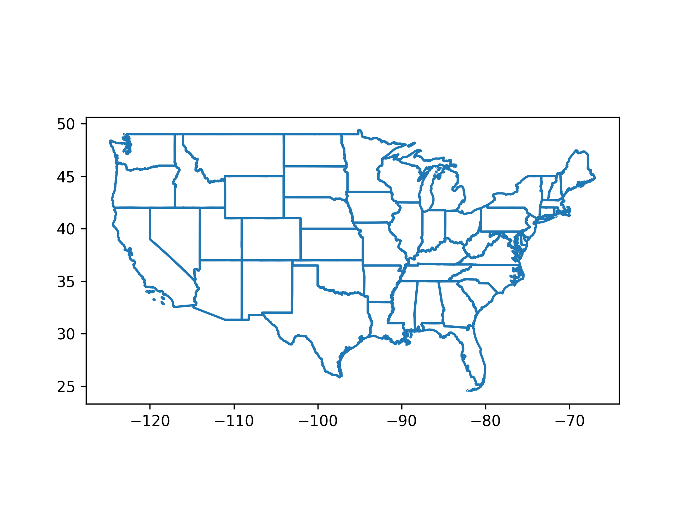
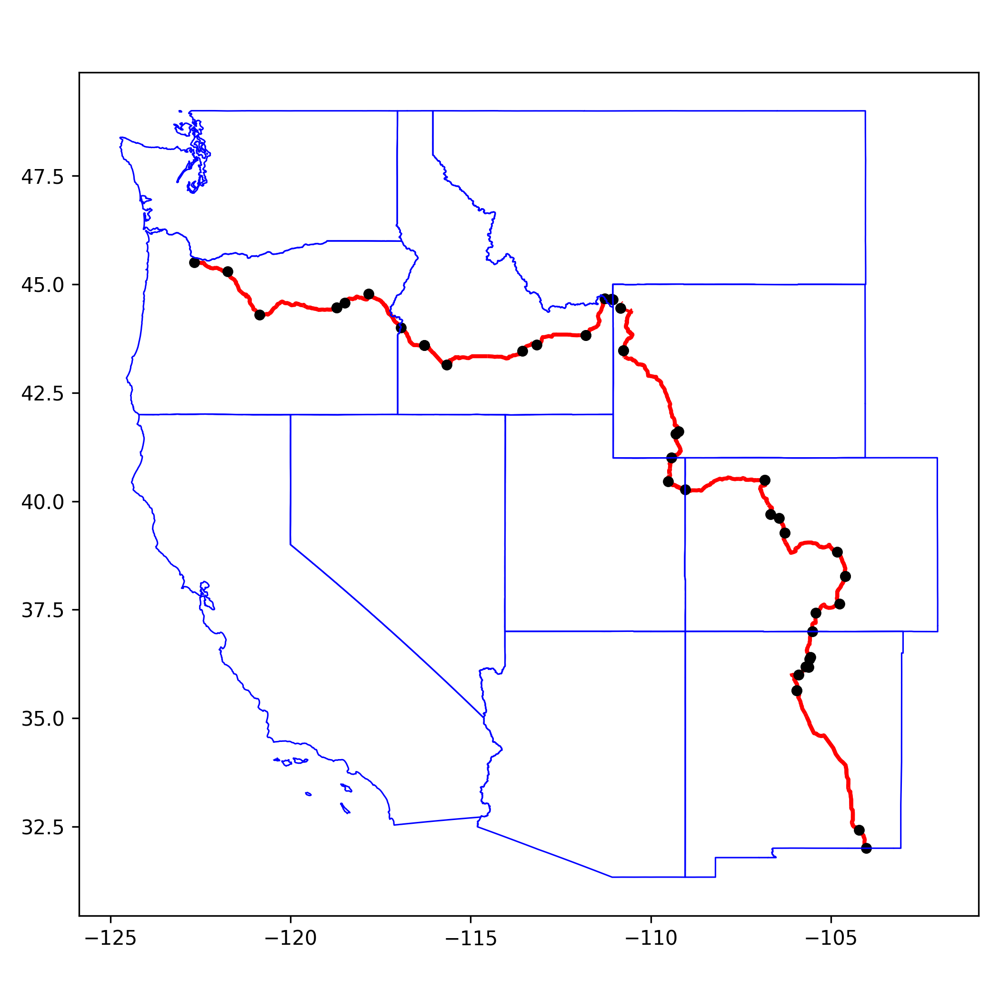
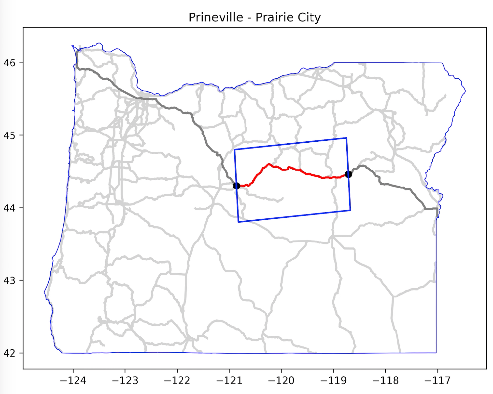
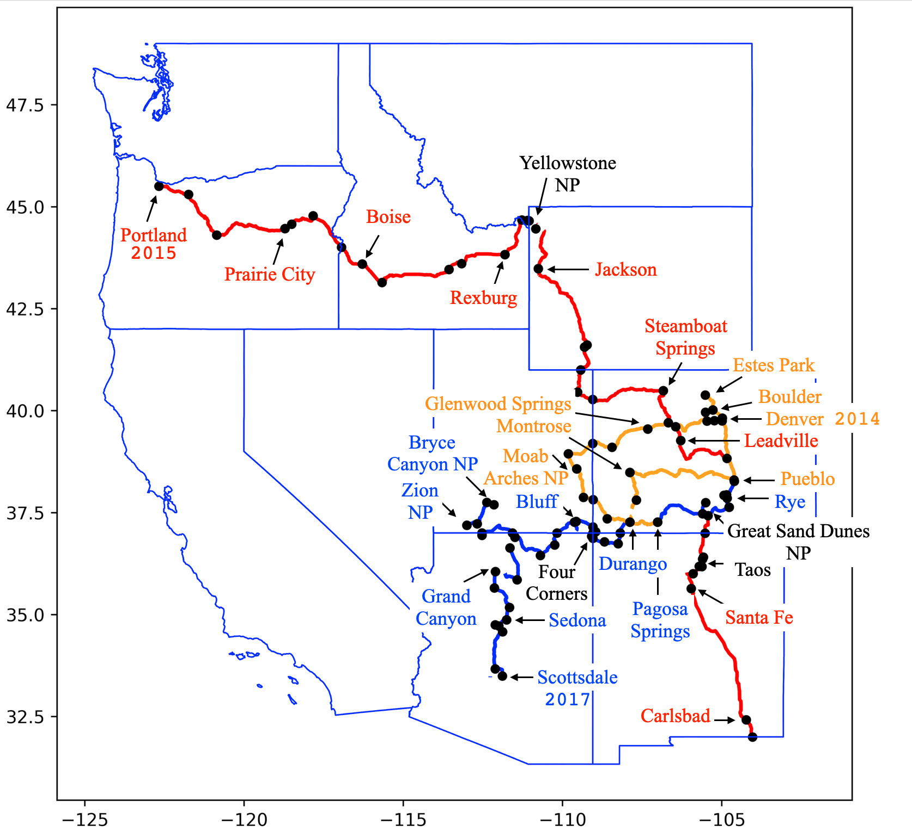

#### GeoPandas mapping project

This project uses [GeoPandas](https://geopandas.org/en/stable/) and [matplotlib](https://matplotlib.org) to retrieve and plot highway data for a trip.  It is somewhat specific for my set-up on macOS but should work on Linux with a little tweaking.

One reason not to make it run-anywhere is that I don't think anyone else is likely to use this code as is, but you may find out how to do certain things by reading here.

Of course the other reason for this repo is so that I will be able to re-learn what I did and also, with luck I won't lose it.

The project is called ``maps4`` and is in a Github repo [here](https://github.com/telliott99/maps4).

#### Testing

I tested it by downloading the zip and unzipping.  You can also do

```
git clone https://github.com/telliott99/maps4
```

But for me at least, this was a bad idea.  A side effect was to wipe out the status of my stored version of ``maps4`` as a git repo.

I put the folder on my Desktop, then ``cd maps4`` and ``python3 test.py all`` and it worked.  However, you will need a few other things.

Python3 should be installed.  

I get that from Homebrew [here](https://brew.sh).  Some people are negative about HB but it works very well for me.  I would never go to Python org and as far as Condas, nope.  

If you use a lot of libraries you may find virtual environments helpful.

My usual "stack" is small:  ``numpy``, ``matplotlib``, ``pandas`` and that's about it.  ``scipy`` comes and goes.

You will need ``geopandas`` and of course, ``matplotlib``, which I get by doing

```
python3 -m pip install geopandas
python3 -m pip install matplotlib
```

#### Data files

Important data files should be made available in ``/Users/<user>/data``.  Edit ``data_path`` in ``utils/ufile.py`` to change the location.

You must provide one for each individual state that you are mapping, like:

```tl_2020_06_prisecroads.zip```

where ``06`` is the FIPS code for Colorado, so this file contains all primary and secondary roads for that state.  

Primary roads should be interstates;  secondary roads are US and state highways, but this convention isn't followed everywhere.

These files are available from [here](https://www.census.gov/cgi-bin/geo/shapefiles/index.php?year=2020&layergroup=Roads) or [here](https://eric.clst.org/tech/usgeojson/) and you can get the very latest from the Census folks [here](https://www.census.gov/cgi-bin/geo/shapefiles/index.php).

There is a single file with all interstate data for the entire US 

``tl_2020_us_primaryroads.zip``

from the same download page.

Another file has outline data for all the states:

```gz_2010_us_040_00_5m.zip```

This file is of intermediate (5m) resolution.

#### where to put the data

As mentioned, to minimize the size of the project files, these big data files are in a folder in my home directory.

They could also be linked to ``maps4/data/`` by doing (in the ``maps4`` folder):

```
ln -s src_dir data
```

Edit ``utils/ufile.py`` appropriately.

#### other data

The trip data is in this format

```
Portland, OR [-122.671608,45.500795]
US Hwy 26
Mount Hood, OR [-121.741884,45.301975]
US Hwy 26
Prineville, OR [-120.859942,44.303650]
US Hwy 26
Prairie City, OR [-118.713342,44.462136]
US Hwy 26
Bates, OR [-118.500782,44.573755]
State Hwy 7
Baker City, OR [-117.829796,44.778326]
I- 84
(OR-ID) [-116.941184,44.006133]
I- 84
Boise, ID [-116.287711,43.596498]
```

There are sources for lat, lon coordinates out there, but the one I have is the top 1000 cities, so it only goes down to 30,000 population or so.  Many places of interest are smaller than that.

I obtained most of the coordinate pairs by clicking on points on Google Maps. 

Note:  the USGS uses an x,y system, i.e. longitude first, while Google Maps uses the more traditional lat, lon format.

I wrote a script to convert from the latter to the former.  It's nice to be able to copy and paste the data in one line into Google Maps search to confirm the assignments.

The state for each segment of point-highway-point is figured out from the points.  Border points are always included like ``(OR-ID)`` but are not assigned to any one state.

The space in ``'I- 84'`` is intentional, that's the way interstates are annotated in the data.  (But it's OK if you write ``I-84``, the code will fix it).

All my route data is in ``maps4/data/``.

New shapefiles go there as well.

#### Basic geopandas

I find myself writing the same boilerplate code repeatedly.  You can see an example [here](demos/template.py).  Let's take a quick look.

Standard imports:

```
import sys,os,subprocess
import geopandas as gpd
import matplotlib.pyplot as plt
```
Load the outline data for the US:

```
fn = 'gz_2010_us_040_00_5m'

HOME = os.path.expanduser('~')
path = HOME + '/data/' + fn
gdf = gpd.read_file(path)
```

A simple filter to remove AK, HI and PR:

```
# filter for lower48
def f(e):
    return not e in ['02','15','72']
    
sel = [f(e) for e in gdf['STATE']]
outline = gdf[sel]
```

The plot:

```
fig,ax = plt.subplots()
outline.boundary.plot()
```

and saving and showing the plot:

```
func_name = __file__.split('.')[0]
ofn = func_name + '.png'
plt.savefig(ofn,dpi=300)
subprocess.run(['open','-a','Preview',ofn])
```

(I don't have a "backend" that will show the result directly, and anyway it's nice to autosave.)





#### CRS

For this project, I have not bothered to project the data to a different coordinate system.  However, it is trivial to do so.  If we load the geodata that we're using from

```gz_2010_us_040_00_5m.zip```

as ``gdf``, you will find that ``gdf.crs`` is ``'EPSG:4269'``, also known as NAD83.  Technically, NAD83 is a "datum".  Normally, one would project the data from NAD83 to something like Albers equal area.

I have an example in the ``demos`` directory.


#### testing

I find it very helpful to run all the tests in ``tests.py`` every time I edit the scripts in the project.  In fact, I run many of the scripts from ``scripts/`` as well.  See ``test.py``.

#### example

Here's a more sophisticated example:



This was generated by ``scripts/route-plot.py cc`` from the data in ``data/cc-adventure.txt``.

#### basic idea

Most of what's done here is standard.  One trick I worked up is to turn the route into segments that have start and end points ``seg.P`` and ``seg.Q`` and a highway name ``seg.name``.  For each segment we also compute its orientation, and that is used to build a box to clip the road data to just that part that lies in the segment.



The underlying highway data consists of thousands of sections of 0.5-50 miles or so each.  Within any one section the points are in order along the route, but the sections are not in order in the file.  Elsewhere, I worked out a method for building directed routes from this data, but it is fussy and I finally decided that it was unnecessary.

#### timestamps

Some of the figures are made with timestamps on them, like ``figs/route-plot-901386.png``.  These numbers are chosen (I hope) so that they are unique, when we re-run a script with a ``png`` output we won't write over the previous one.  But also, they'll sort in order by time of generation.  See  ``utils/plot_helper.py``.

#### goal achieved

Here is a hand-annotated map of three trips.



#### interstates

The problem I wanted to work on was to build the image shown just above using primarily US Highway and State Rte information.  This data comes in per-state format, so that's the default.

For interstate routes between cities draws on data that is in a single national file.  It's not yet integrated properly with the code in ``scripts/route-build.py``, although there are a few examples in the ``demos/`` directory and one in ``scripts/``.

#### More

More info

- [notes](notes/organization.md) on organization
- [demos](demos/notes-demos.md)


revised:  2023-06-15